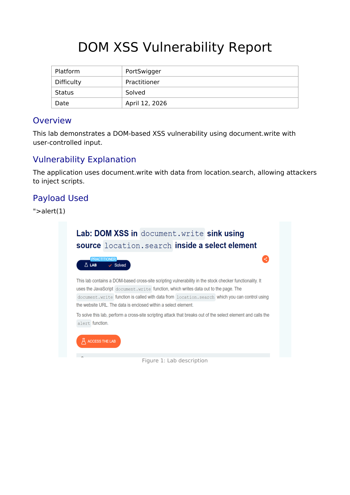
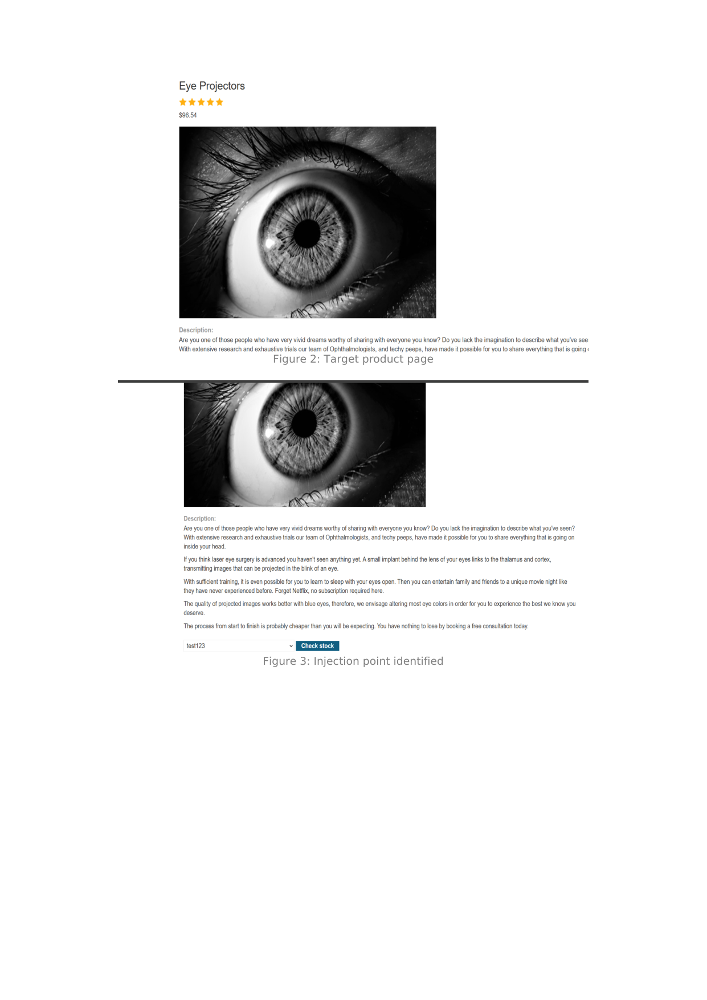
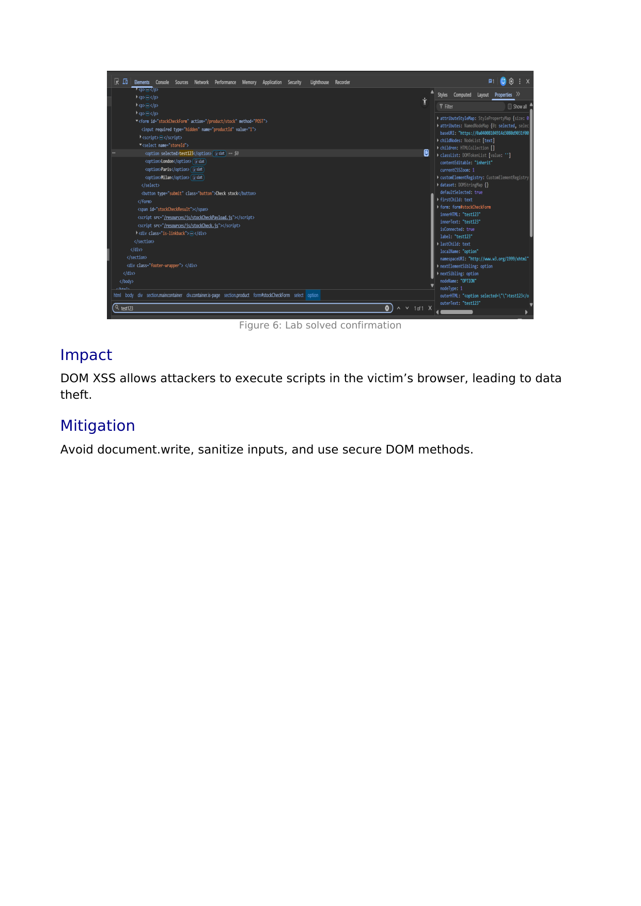

# Lab Writeup: DOM XSS in `document.write` Sink Using Source `location.search` Inside a Select Element

> **Platform:** PortSwigger Web Security Academy  
> **Category:** Cross-Site Scripting (XSS) — DOM-Based  
> **Difficulty:** Practitioner  
> **Status:** ✅ Solved  
> **Date:** April 2026  

---

## Table of Contents

- [Overview](#overview)
- [Vulnerability Description](#vulnerability-description)
- [Tools Used](#tools-used)
- [Exploitation Steps](#exploitation-steps)
- [Root Cause Analysis](#root-cause-analysis)
- [Remediation](#remediation)
- [Key Takeaways](#key-takeaways)

---

## Overview

This lab demonstrates a **DOM-based Cross-Site Scripting (XSS)** vulnerability in a stock checker feature. The JavaScript sink `document.write` is called with data sourced directly from `location.search` with no sanitization, allowing an attacker to inject arbitrary HTML by crafting a malicious URL. The input lands inside a `<select>` element, requiring a context breakout.

**Objective:** Break out of the `<select>` element context and call `alert(1)`.



---

## Vulnerability Description

| Attribute | Detail |
|-----------|--------|
| **Vulnerability Type** | DOM-Based Cross-Site Scripting (XSS) |
| **OWASP Category** | A03:2021 – Injection |
| **Source** | `location.search` (attacker-controlled URL query string) |
| **Sink** | `document.write()` |
| **Injection Context** | Inside a `<select>` element — requires element breakout |
| **Impact** | Arbitrary script execution in the victim's browser via crafted URL |

The vulnerable JavaScript pattern:

```javascript
var store = (new URLSearchParams(location.search)).get('storeId');
document.write('<select name="storeId"><option value="' + store + '">' + store + '</option></select>');
```

Because `location.search` flows directly into `document.write` without encoding, an attacker fully controls what HTML gets written to the DOM.

---

## Tools Used

- **Browser DevTools** – DOM inspection and source analysis
- **Browser URL bar** – Payload delivery via crafted URL

---

## Exploitation Steps

### Step 1 — Identify the Target Product Page

Navigate to any product page containing the stock checker feature. The page shows a location `<select>` dropdown populated from a URL parameter.



---

### Step 2 — Confirm the Injection Point

Append a test value to the URL as `storeId`:

```
/product?productId=1&storeId=test123
```

Observe `test123` appearing inside the `<select>` dropdown — confirming the parameter flows directly into the DOM via `document.write`.

---

### Step 3 — Inspect the DOM Context

Open **DevTools → Elements** and find the rendered `<select>`:

```html
<select name="storeId">
  <option value="test123">test123</option>
  ...
</select>
```

To execute JavaScript, the payload must first close the open `<option>` attribute quote, then break out of the `<select>` element entirely.


---

### Step 4 — Craft and Deliver the Payload

The payload closes the attribute and `<select>` context, then injects a script:

```
">alert(1)
```

Delivered via URL:

```
/product?productId=1&storeId="><script>alert(1)</script>
```

When the page loads, `document.write` renders the injected HTML. The browser parses and executes the `<script>` tag, firing `alert(1)`.

---

### Step 5 — Lab Solved

The alert dialog confirms successful DOM XSS execution and the lab is marked solved.



---

## Root Cause Analysis

```
URL: /product?storeId="><script>alert(1)</script>
                │
                ▼
        location.search  ← SOURCE (fully attacker-controlled)
                │
                ▼
        document.write(  ← SINK (writes raw HTML to DOM)
          '<select>...' + storeId + '...'
        )
                │
                ▼
        Browser parses injected HTML → executes <script>alert(1)</script>
```

**Why this is purely client-side:**
The payload never reaches the server. The browser fetches the page normally, then the JavaScript reads `location.search` and writes attacker-controlled HTML directly into the DOM — entirely invisible to server-side WAFs and filters.

---

## Remediation

| Recommendation | Description |
|----------------|-------------|
| **Replace `document.write`** | Use `document.createElement` and `.textContent` to build elements safely — these APIs never parse or execute HTML. |
| **Use `textContent` not `innerHTML`** | For inserting user-controlled values, `.textContent` treats the value as plain text with no HTML interpretation. |
| **Encode output before DOM insertion** | If raw string concatenation into HTML is unavoidable, HTML-entity-encode all user input first. |
| **Implement Content Security Policy (CSP)** | A strict CSP (`script-src 'self'`) blocks inline script execution, providing defence-in-depth even if XSS fires. |

---

## Key Takeaways

- **DOM XSS is entirely client-side** — the payload never hits the server, making it invisible to server-side defences.
- **`document.write` is a dangerous legacy API** and should never be used with untrusted input.
- **Understanding injection context is critical.** The `<select>` context required a specific breakout sequence; a generic `<script>alert(1)</script>` alone would not work without the `">` prefix.
- **`location.search` is a user-controlled source.** Any data from the URL query string, hash, or referrer flowing into a DOM sink without sanitization is exploitable.

---

*Writeup produced as part of PortSwigger Web Security Academy lab practice.*
