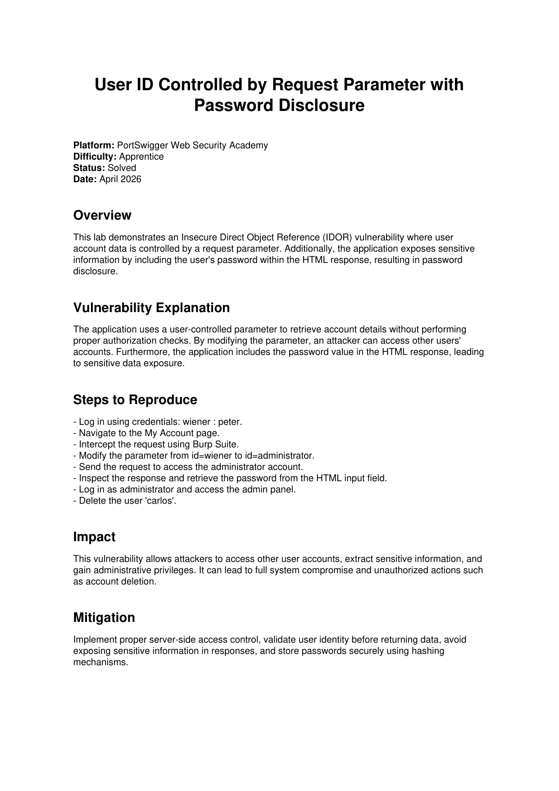

# Lab Writeup: User ID Controlled by Request Parameter with Password Disclosure

> **Platform:** PortSwigger Web Security Academy  
> **Category:** Insecure Direct Object References (IDOR)  
> **Difficulty:** Apprentice  
> **Status:** ✅ Solved  
> **Date:** April 2026  

---

## Table of Contents

- [Overview](#overview)
- [Vulnerability Description](#vulnerability-description)
- [Tools Used](#tools-used)
- [Exploitation Steps](#exploitation-steps)
- [Root Cause Analysis](#root-cause-analysis)
- [Remediation](#remediation)
- [Key Takeaways](#key-takeaways)

---

## Overview

This lab demonstrates an **Insecure Direct Object Reference (IDOR)** vulnerability where the application uses a user-controlled request parameter to retrieve account details without performing proper server-side authorization checks. Compounding the issue, the application exposes the user's **plaintext password** directly in the HTML response — a critical case of sensitive data exposure.

**Objective:** Exploit the IDOR to access the administrator account, retrieve their password from the HTML response, log in as administrator, and delete the user `carlos`.



---

## Vulnerability Description

| Attribute | Detail |
|-----------|--------|
| **Vulnerability Type** | Insecure Direct Object Reference (IDOR) + Sensitive Data Exposure |
| **OWASP Category** | A01:2021 – Broken Access Control / A02:2021 – Cryptographic Failures |
| **Affected Endpoint** | `GET /my-account?id=<username>` |
| **Root Cause** | No server-side authorization check on the `id` parameter; password rendered in HTML |
| **Impact** | Full account takeover, credential theft, admin privilege escalation |

The vulnerable endpoint retrieves account data based solely on the `id` query parameter:

```
GET /my-account?id=wiener
```

There is no check that the authenticated session matches the requested `id`. An attacker simply substitutes any other username to access that account's data — including the pre-filled password field rendered in the response HTML.

---

## Tools Used

- **Burp Suite** – HTTP interception, request modification, and Repeater
- **Browser** – PortSwigger Web Security Academy lab environment

---

## Exploitation Steps

### Step 1 — Log In with Known Credentials

Log in using the provided test account:

```
Username: wiener
Password: peter
```

Navigate to the **My Account** page after login.

---

### Step 2 — Intercept the My Account Request in Burp Suite

With Burp Suite's Proxy active, navigate to **My Account**. The intercepted request reveals the `id` parameter:

```http
GET /my-account?id=wiener HTTP/2
Host: <lab-id>.web-security-academy.net
Cookie: session=<session-token>
```

Send this request to **Repeater**.

---

### Step 3 — Modify the `id` Parameter to `administrator`

Change the parameter value from `wiener` to `administrator`:

```http
GET /my-account?id=administrator HTTP/2
Host: <lab-id>.web-security-academy.net
Cookie: session=<session-token>
```

Send the request. The server returns the administrator's account page without performing any authorization check.

---

### Step 4 — Extract the Password from the Response

Inspect the HTML response. The administrator's password is embedded in a pre-filled `<input>` field:

```html
<input required type="password" name="password" value="ADMIN_PASSWORD_HERE">
```

Copy the plaintext password directly from the response body.

---

### Step 5 — Log In as Administrator and Delete `carlos`

1. Log out of the `wiener` session.
2. Log in using `administrator` and the extracted password.
3. Navigate to the **Admin Panel**.
4. Delete the user `carlos` to complete the lab.

---

## Root Cause Analysis

```
Attacker (authenticated as wiener)         Server
              │                               │
              │  GET /my-account?id=wiener    │
              │──────────────────────────────>│  ← normal flow
              │  <wiener account page>        │
              │<──────────────────────────────│
              │                               │
              │  GET /my-account?id=admin     │
              │──────────────────────────────>│  ← NO AUTHZ CHECK
              │  <admin account + password>   │
              │<──────────────────────────────│
```

Two distinct flaws combine to create critical impact:

1. **Missing Authorization Check** — The server retrieves any user's account page based entirely on the client-supplied `id` value. The session is never validated against the requested resource.
2. **Plaintext Password in HTML Response** — The password is stored and transmitted in a form that can be read directly from the HTTP response, bypassing any at-rest encryption.

---

## Remediation

| Recommendation | Description |
|----------------|-------------|
| **Derive identity from the session, not parameters** | Retrieve the account page for the user associated with the current server-side session. Never trust a client-supplied identifier to determine which data to return. |
| **Enforce server-side object-level authorization** | Before returning any resource identified by an ID, verify the requesting session is authorized to access that specific object. |
| **Never expose passwords in responses** | Passwords must not appear in HTML, JSON, or API responses in any form. |
| **Hash passwords at rest** | Store passwords using a strong, salted hashing algorithm (bcrypt, Argon2). |

---

## Key Takeaways

- **IDOR is one of the most common and impactful access control flaws.** Simply changing a URL parameter can expose any user's data.
- **Never use client-controlled identifiers for authorization.** User identity must be derived from the server-side session.
- **Sensitive data exposure amplifies every other vulnerability.** Exposing plaintext passwords in responses is a standalone critical issue.
- This lab shows how **two simple flaws chained together** result in full administrative compromise.

---

*Writeup produced as part of PortSwigger Web Security Academy lab practice.*
