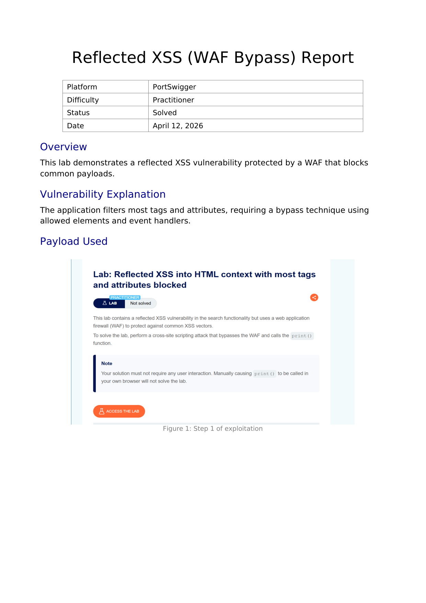
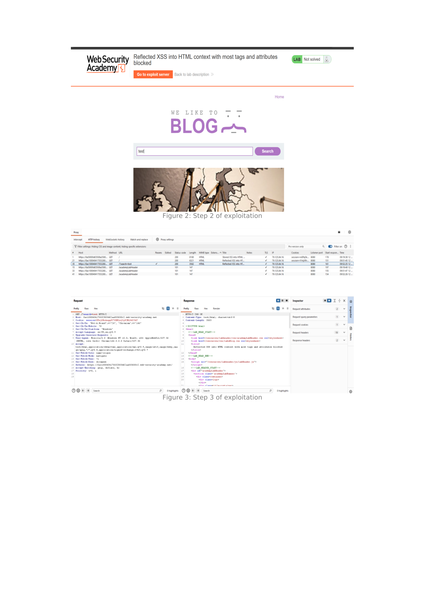
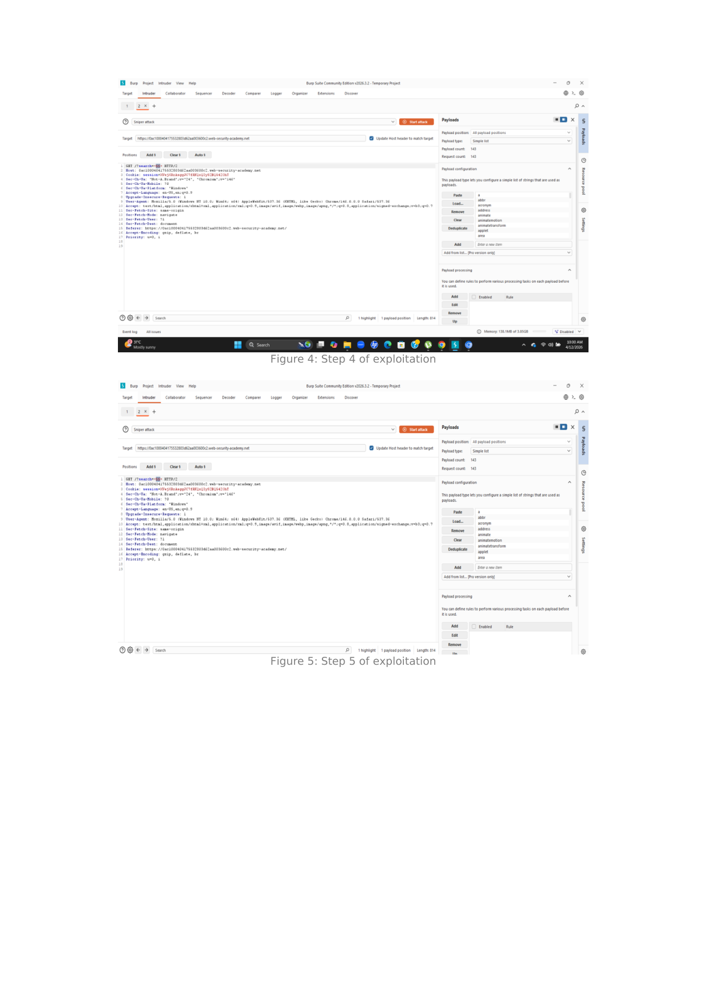
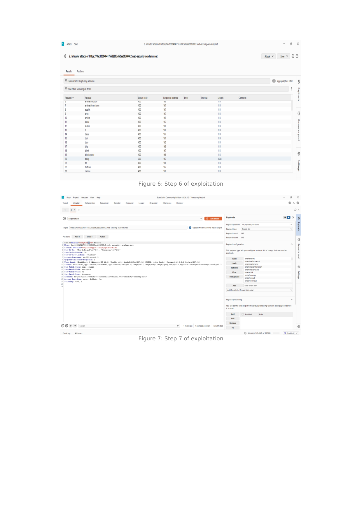
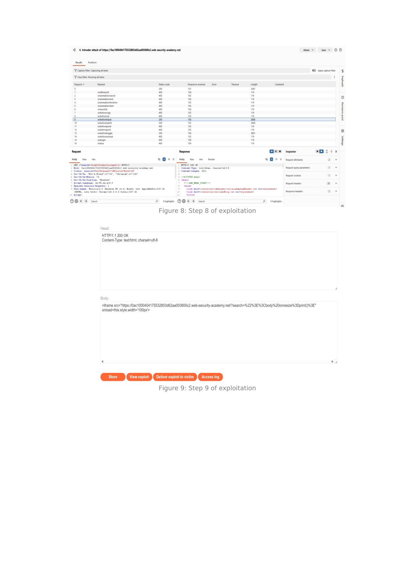
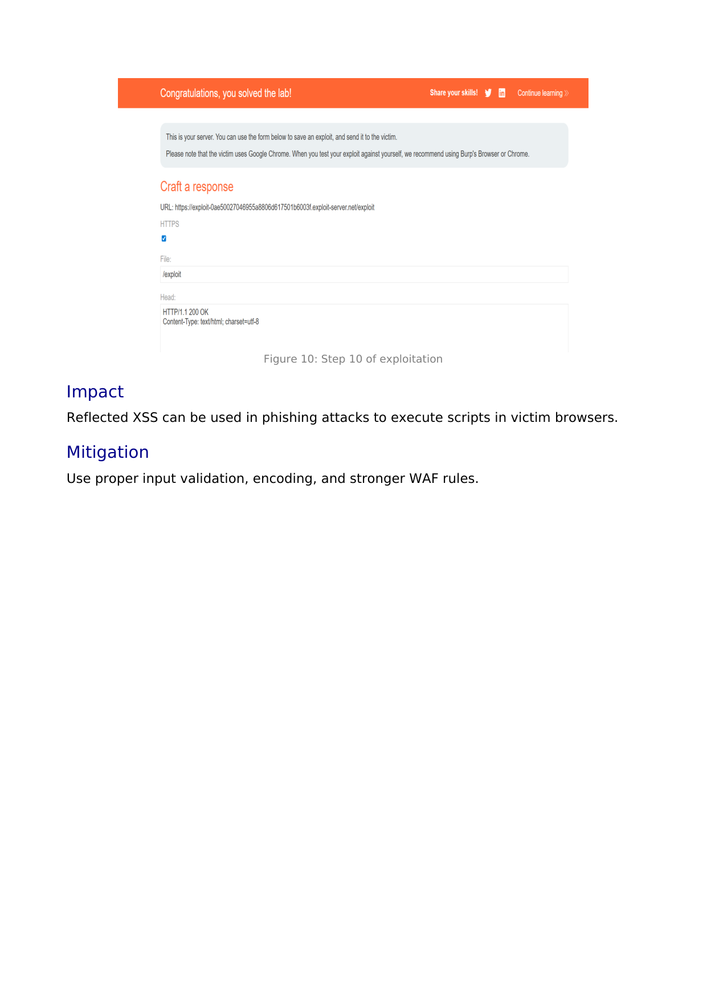

# Lab Writeup: Reflected XSS into HTML Context with Most Tags and Attributes Blocked (WAF Bypass)

> **Platform:** PortSwigger Web Security Academy  
> **Category:** Cross-Site Scripting (XSS) — Reflected  
> **Difficulty:** Practitioner  
> **Status:** ✅ Solved  
> **Date:** April 2026  

---

## Table of Contents

- [Overview](#overview)
- [Vulnerability Description](#vulnerability-description)
- [Tools Used](#tools-used)
- [Exploitation Steps](#exploitation-steps)
- [Root Cause Analysis](#root-cause-analysis)
- [Remediation](#remediation)
- [Key Takeaways](#key-takeaways)

---

## Overview

This lab demonstrates a **Reflected XSS** vulnerability in a search feature protected by a **Web Application Firewall (WAF)** that blocks most common HTML tags and event attributes. The challenge requires systematically enumerating which tags and event handlers slip through the WAF, then crafting a zero-interaction exploit that calls `print()` automatically when a victim loads the URL.

**Objective:** Bypass the WAF and deliver a reflected XSS attack that calls `print()` without requiring any user interaction.



---

## Vulnerability Description

| Attribute | Detail |
|-----------|--------|
| **Vulnerability Type** | Reflected XSS — WAF Bypass |
| **OWASP Category** | A03:2021 – Injection |
| **Injection Point** | Search query parameter reflected in HTML response |
| **Protection** | WAF blocklist filtering most HTML tags and event handlers |
| **Bypass Technique** | Enumerate allowed tags (`<body>`) and handlers (`onresize`) via Burp Intruder |
| **Delivery** | Exploit server hosts `<iframe>` that triggers resize → `print()` automatically |
| **Impact** | Zero-interaction script execution in victim's browser |

---

## Tools Used

- **Burp Suite Intruder** – Automated enumeration of WAF-allowed tags and event handlers
- **Burp Suite Proxy / Repeater** – Request capture and manual verification
- **Exploit Server** – Hosting and delivering the malicious iframe payload

---

## Exploitation Steps

### Step 1 — Confirm WAF Blocks Standard Payloads

Enter a standard XSS payload in the search bar:

```html
<script>alert(1)</script>
```

The WAF returns `400 Bad Request` — confirming that common tags are blocked.

---

### Step 2 — Capture the Search Request and Identify the Reflection Point

Use the search bar with a benign term. Capture the request in Burp Proxy, then confirm the search term is reflected unencoded in the HTML response. This is the injection point.



---

### Step 3 — Enumerate Allowed HTML Tags via Burp Intruder (Attack 1)

Send the search request to **Intruder**. Set the payload position on the search term and load PortSwigger's XSS tag list as a **Simple List** payload. Run a Sniper attack with all tags wrapped in `<>`.

Filter results by status code: `200 OK` = allowed by WAF, `400` = blocked.

**Result:** `<body>` and `<iframe>` return `200` — they are permitted.



---

### Step 4 — Review Tag Scan Results

From the Intruder results table, identify which tags returned `200 OK`. The key finding is that `<body>` returns `200` with a larger response length, indicating it is reflected and rendered.



---

### Step 5 — Enumerate Allowed Event Handlers (Attack 2)

Run a second Intruder attack to find which event handler attributes are permitted with the `<body>` tag:

```
GET /?search=<body §onresize§=print()>
```

Load PortSwigger's event handler cheat sheet as the payload. Filter for `200 OK` responses.

**Result:** `onresize` is not blocked by the WAF.



---

### Step 6 — Craft the Zero-Interaction Exploit

Since `onresize` fires when element dimensions change, use an `<iframe>` to programmatically trigger the resize on load — requiring zero user interaction:

```html
<iframe 
  src="https://<lab-id>.web-security-academy.net/?search=%22%3E%3Cbody%20onresize=print()%3E" 
  onload="this.style.width='100px'">
</iframe>
```

**How it works:**
1. The iframe loads the lab's search page with `<body onresize=print()>` injected.
2. The outer iframe's `onload` changes its own `width`, causing a resize.
3. The `onresize` event fires inside the iframe → `print()` executes automatically.

Place this payload in the **Exploit Server** body, click **Store**, then **Deliver exploit to victim**.

---

### Step 7 — Lab Solved

When the victim's browser loads the exploit page, the iframe resize chain fires `print()` and the lab is marked solved.



---

## Root Cause Analysis

```
Attacker payload: <body onresize=print()>
         │
         ▼
WAF checks tag list:
  <script> → BLOCKED (400)
  <body>   → ALLOWED (200) ← oversight in blocklist
         │
         ▼
Server reflects input into HTML without encoding
         │
         ▼
Exploit iframe triggers onresize via width change on load
         │
         ▼
print() executes — zero interaction required
```

The WAF uses a **blocklist** model, which is fundamentally incomplete. Any tag or event handler not explicitly listed is permitted. The `<body onresize>` combination was not in the blocklist.

The underlying flaw is that the server **does not HTML-encode reflected user input** — the WAF is the only protection layer, and it failed.

---

## Remediation

| Recommendation | Description |
|----------------|-------------|
| **HTML-encode all reflected output** | The primary fix: encode `<`, `>`, `"`, `'`, `&` in all user input reflected into HTML. This neutralizes injected markup regardless of WAF. |
| **Switch WAF to allowlist model** | Define what IS permitted (e.g. alphanumeric search terms) rather than what isn't. Allowlists cannot be enumerated around. |
| **Implement Content Security Policy (CSP)** | A strict CSP with `script-src 'self'` and no `unsafe-inline` blocks inline event handlers from executing. |
| **Never rely on WAF as the sole XSS defence** | WAFs are a useful depth-in-defence layer, not a primary control. Server-side output encoding must be present regardless. |

---

## Key Takeaways

- **WAF blocklists can always be bypassed** through systematic enumeration — Burp Intruder makes this fast and repeatable.
- **`onresize` enables zero-interaction XSS** — it fires programmatically when an iframe is resized via JavaScript, requiring no user click.
- **The correct fix is server-side output encoding**, not WAF rules. Encoding turns `<body onresize=print()>` into `&lt;body onresize=print()&gt;` — harmless plain text.
- **Two Intruder attacks** (tags first, then event handlers) are the standard methodology for WAF bypass enumeration.

---

*Writeup produced as part of PortSwigger Web Security Academy lab practice.*
