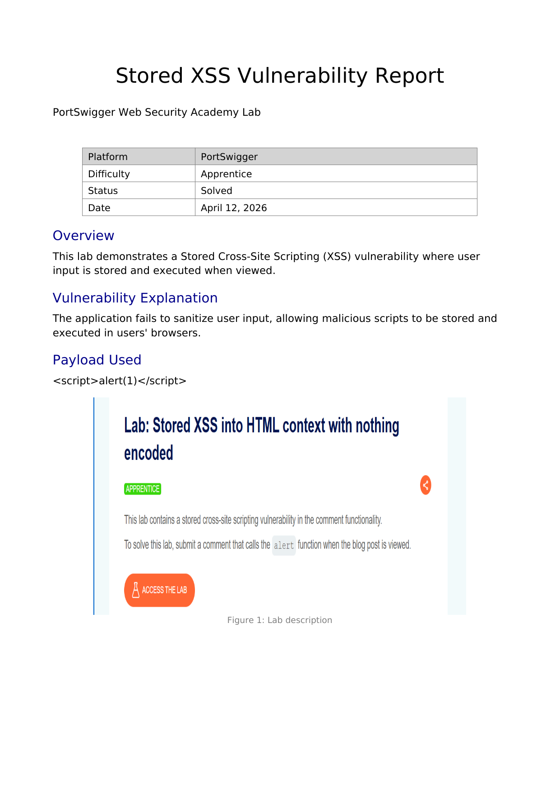
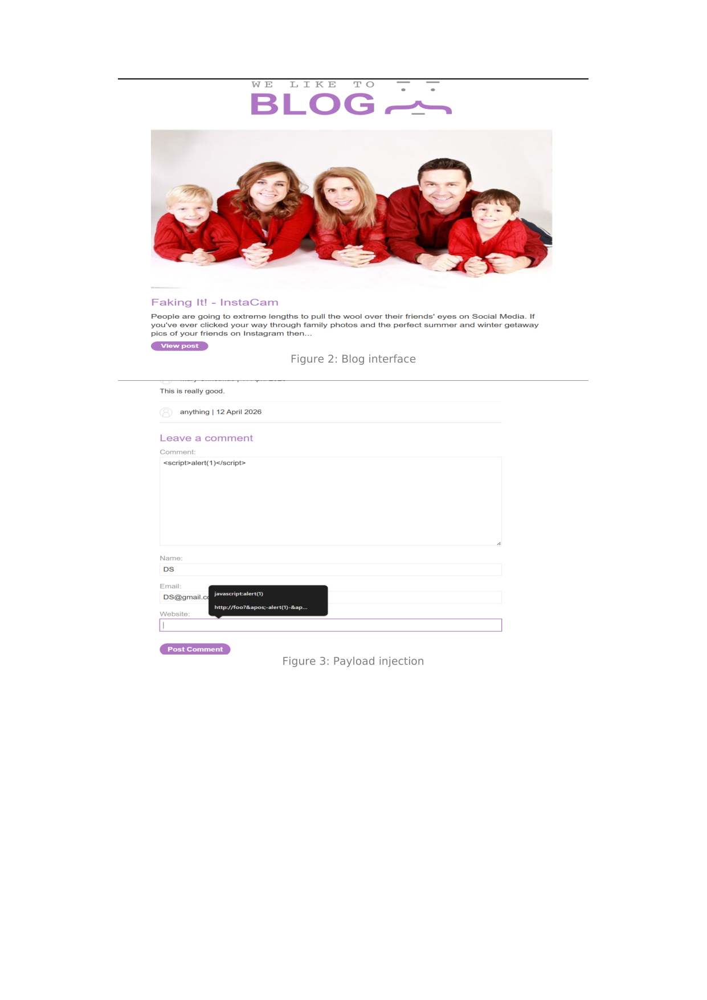
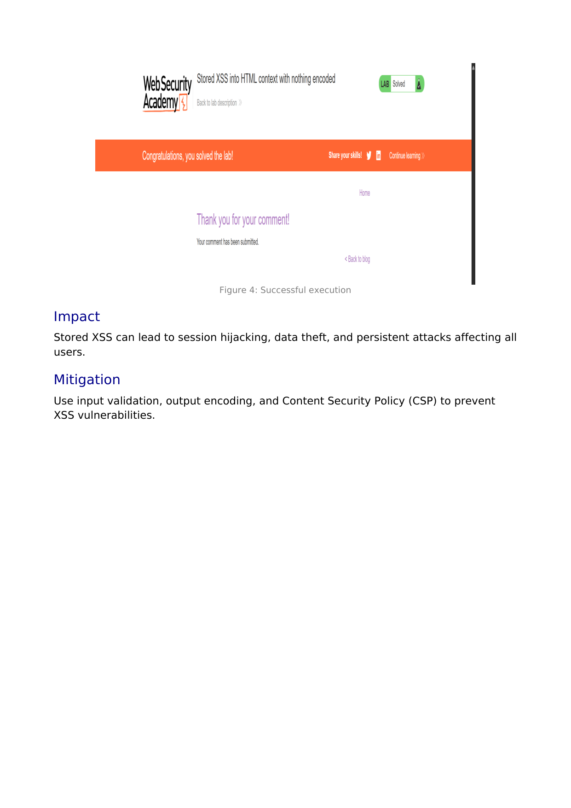

# Lab Writeup: Stored XSS into HTML Context with Nothing Encoded

> **Platform:** PortSwigger Web Security Academy  
> **Category:** Cross-Site Scripting (XSS) — Stored  
> **Difficulty:** Apprentice  
> **Status:** ✅ Solved  
> **Date:** April 2026  

---

## Table of Contents

- [Overview](#overview)
- [Vulnerability Description](#vulnerability-description)
- [Tools Used](#tools-used)
- [Exploitation Steps](#exploitation-steps)
- [Root Cause Analysis](#root-cause-analysis)
- [Remediation](#remediation)
- [Key Takeaways](#key-takeaways)

---

## Overview

This lab demonstrates a **Stored (Persistent) Cross-Site Scripting (XSS)** vulnerability in a blog comment feature. User-supplied input is saved to the database and rendered back into the page **without any HTML encoding or sanitization**, allowing an attacker to permanently embed malicious scripts that execute in every visitor's browser when the post is viewed.

**Objective:** Submit a comment containing a script payload that calls `alert(1)` when any user views the blog post.



---

## Vulnerability Description

| Attribute | Detail |
|-----------|--------|
| **Vulnerability Type** | Stored (Persistent) Cross-Site Scripting (XSS) |
| **OWASP Category** | A03:2021 – Injection |
| **Injection Point** | Blog post `comment` field |
| **Persistence** | Payload stored in server-side database |
| **Trigger** | Executes automatically for every user who views the blog post |
| **Impact** | Persistent script execution; session hijacking, credential theft, defacement |

**Payload Used:**

```html
<script>alert(1)</script>
```

---

## Tools Used

- **Browser** – Payload submission via the comment form
- **PortSwigger Web Security Academy** lab environment

---

## Exploitation Steps

### Step 1 — Navigate to a Blog Post

Open any blog post on the lab application. Scroll to the **Leave a Comment** section at the bottom.



---

### Step 2 — Inject the Payload into the Comment Field

In the **Comment** field, enter:

```html
<script>alert(1)</script>
```

Fill in the remaining required fields (Name, Email) with any values. Click **Post Comment**.

The application stores the raw comment — including the `<script>` tag — directly in the database with no sanitization.

---

### Step 3 — Trigger the Stored XSS

Navigate back to the blog post. The server fetches the stored comment and renders it directly into the HTML response without encoding:

```html
<div class="comment-body">
  <script>alert(1)</script>   <!-- rendered verbatim -->
</div>
```

The browser parses and executes the `<script>` tag instantly. The `alert(1)` dialog fires and the lab is marked as solved.



---

## Root Cause Analysis

```
Attacker submits comment:
  <script>alert(1)</script>
           │
           ▼
Server stores RAW input in database  ← no sanitization on write
           │
           ▼
Any user visits the blog post
           │
           ▼
Server fetches stored comment → renders into HTML:
  <div class="comment"><script>alert(1)</script></div>
           │                    ↑
           │          no encoding on read either
           ▼
Browser executes <script> → alert(1) fires for EVERY visitor
```

**Why stored XSS is more dangerous than reflected XSS:**

- The payload is **persistent** — it does not require the attacker to be present after the initial submission.
- **Every user** who visits the page is affected, not just those who click a crafted link.
- No social engineering is needed post-injection.
- In a real attack, replacing `alert(1)` with a cookie-stealing payload would enable **mass session hijacking**.

---

## Key Takeaways

- **Stored XSS is a persistent, multi-victim vulnerability.** A single malicious comment can compromise every future visitor to the page.
- **The fix is output encoding, not input filtering.** Filtering `<script>` on submission can be bypassed with obfuscation; encoding on output is robust and context-aware.
- **Comment sections, reviews, usernames, and profile fields are high-risk injection points.** Any user content stored and later displayed must be treated as untrusted.
- **`alert(1)` is proof-of-concept only.** Real-world payloads exfiltrate session cookies, redirect to phishing pages, or perform actions as the victim.

---

*Writeup produced as part of PortSwigger Web Security Academy lab practice.*
